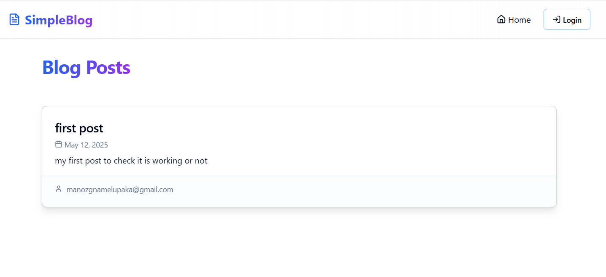
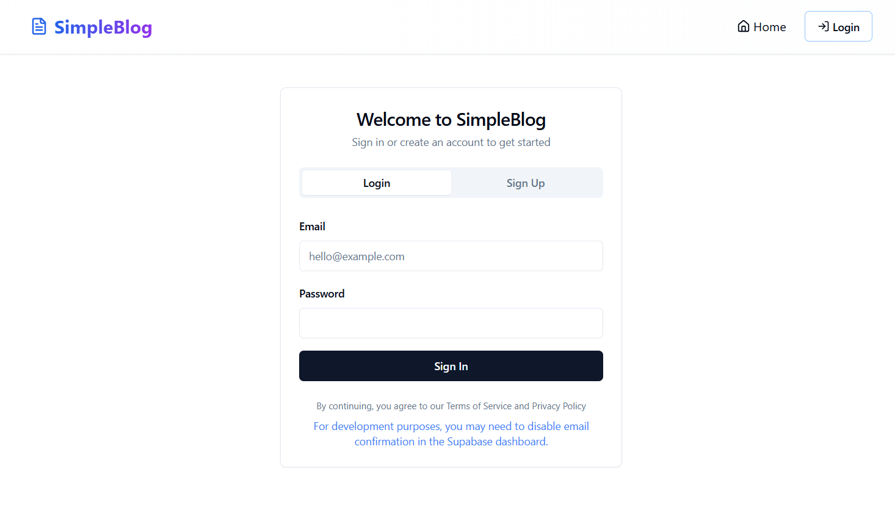
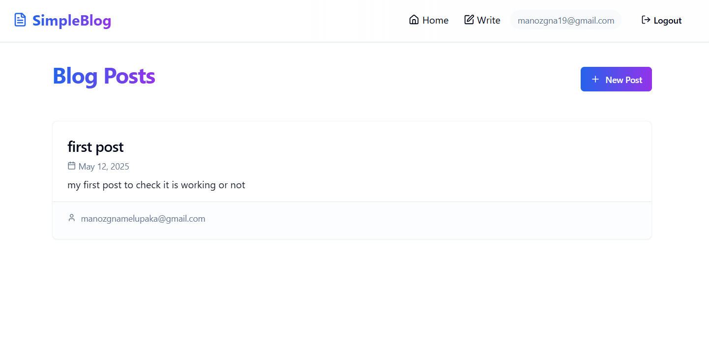
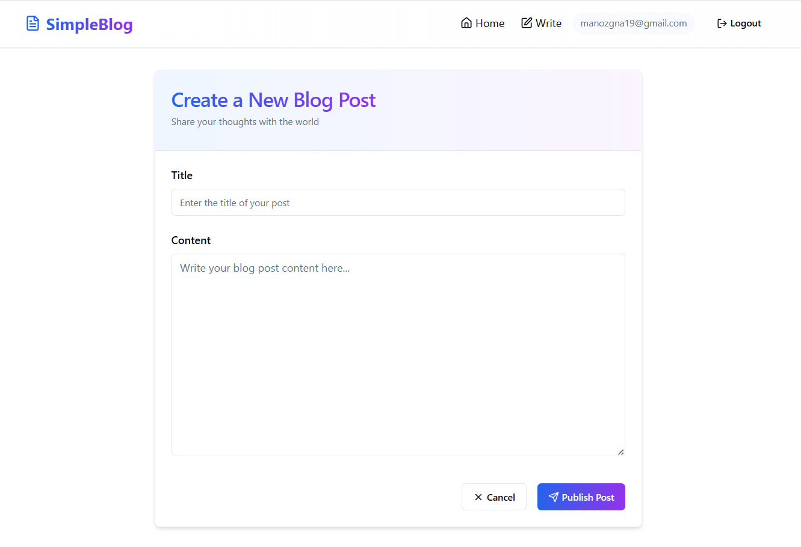

# 📝 Easy Blog Byttes

A simple blog platform built with **React**, **Supabase**, and **Tailwind CSS**. Users can sign up, log in, view blog posts, and create new posts—all with a clean, responsive UI.

---

 # 📎 Live Demo : 
  
  👉 [easy-blog-byttes.vercel.app](https://easy-blog-byttes.vercel.app)

 # 📎GitHub Repository:
 
   👉 [github.com/Manozgna19/easy-blog-byttes](https://github.com/Manozgna19/easy-blog-byttes)

# 📸UI Preview

## 🏠 Home Page

--
## 🔐 Login / Signup Page
<br><br>
--
## ✅ After Login - Add Post Access

--
## 📝 Create Post Page



## ✨ Features

- 🔐 **Authentication** using Supabase (Sign Up / Log In / Log Out)
- 📖 **Public blog post listing**
- ✍️ **Create a new blog post** (only for logged-in users)
- 🚫 **Protected routes** (only logged-in users can access `/new`)
- 💬 **Author's email** shown under each post (bonus)
- 🌀 **Loading indicators** while fetching data (bonus)
- ✅ **Form validation** for required fields (bonus)
- 📱 **Mobile responsive UI** using Tailwind (bonus)

## Tech Stack

- **Frontend**: React + Vite + TypeScript
- **Routing**: React Router DOM
- **Backend**: Supabase (Database + Auth)
- **Styling**: Tailwind CSS
- **Deployment**: Vercel

## 📁 Project Structure

        simple-blog/
        │
        ├── public/                         # Static files like favicon, manifest
        │
        ├── src/
        │   ├── assets/                    # Images, fonts, static resources
        │
        │   ├── components/               # Reusable UI components
        │   │   ├── ui/                   # Generic UI components (e.g., Button, Input)
        │   │   ├── Navbar.tsx
        │   │   └── ProtectedRoute.tsx   # Wrapper for auth-protected pages
        │
        │   ├── contexts/                 # React Contexts (e.g., Auth context)
        │
        │   ├── hooks/                    # Custom React hooks
        │
        │   ├── integrations/
        │   │   └── supabase/            # Supabase related logic
        │   │       └── supabase.ts      # Supabase client setup
        │
        │   ├── lib/                      # Utility functions
        │   │   └── utils.ts
        │
        │   ├── pages/                    # All page components
        │   │   ├── HomePage.tsx
        │   │   ├── LoginPage.tsx
        │   │   ├── NewPostPage.tsx
        │   │   └── NotFound.tsx
        │
        │   ├── App.tsx                   # Main app component with routing
        │   ├── App.css
        │   ├── index.css                 # Tailwind base styles
        │   ├── main.tsx                  # Entry point
        │   └── vite-env.d.ts
        │
        ├── .gitignore
        ├── index.html
        ├── package.json
        ├── postcss.config.js
        ├── tailwind.config.ts
        ├── tsconfig.json
        ├── tsconfig.app.json
        ├── tsconfig.node.json
        ├── vite.config.ts
        ├── README.md
        └── LICENSE
        


## Getting Started

### ⚙️ Installation
```bash

# Clone the repo
git clone https://github.com/Manozgna19/easy-blog-byttes.git

# Navigate into the project
cd easy-blog-byttes

# Install dependencies
npm install

# Setup environment variables
Create a .env file in the root directory and add your Supabase credentials:

VITE_SUPABASE_URL=your_supabase_project_url
VITE_SUPABASE_ANON_KEY=your_supabase_anon_key

```


### Please refer to the [**Source Code**](https://github.com/Manozgna19/easy-blog-byttes.git)  for more details

For any further queries, feel free to connect via [**LinkedIn**](https://www.linkedin.com/in/manozgna-m) ; [**Email**](manozgnamelupaka@gmail.com)